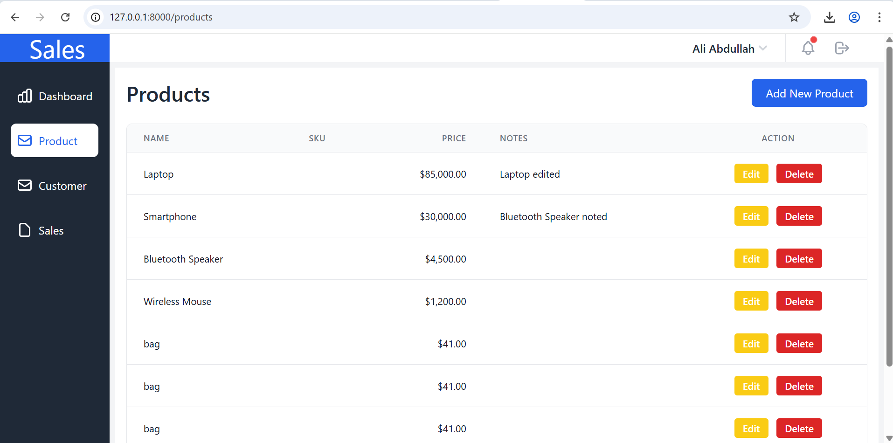

# Sales Management System

A modern Laravel-based Sales Management System with customer management, product handling, sales entry, notes, and soft-delete support. Built with Tailwind CSS for a clean UI.

## ✨ Features

- 👥 Customer Management (Add, Edit, Delete, Soft Delete)
- 📦 Product Management with Notes
- 🧾 Sales Entry with Dynamic Line Items
- 🔍 Sales Filter, Search, and Pagination
- 🗑️ Trash View with Restore Option
- 📝 Attach Notes to Sales and Products (Polymorphic Relation)
- ✅ Advanced Form Validation
- 💻 Responsive UI with Tailwind CSS
- 📄 Pagination, Soft Deletes, and Alerts


---

## 📸 Screenshots

### 👤 Customer Add


### 👤 Customer Edit


### 👥 Customer List


### ➕ Product Add


### ✏️ Product Edit


### 📦 Product List with Notes


### 📋 Sales List with Filters, Invoice, Delete


### 📋 Sales Add With Notes


### 🧾 Invoice View with Notes


### ♻️ Trash with Restore


---


## Technologies

- Laravel 12
- MySQL
- Tailwind CSS
- Blade templating
- Eloquent ORM

## Installation

```bash
git clone https://github.com/MohammadAliAbdullah/it-way-task2.git
cd it-way-task2
cp .env.example .env
composer install
php artisan key:generate
php artisan migrate --seed
php artisan serve
```

## Database Configuration

Update the `.env` file with your DB settings:

```env
DB_CONNECTION=mysql
DB_HOST=127.0.0.1
DB_PORT=3306
DB_DATABASE=sales_db
DB_USERNAME=root
DB_PASSWORD=
```

## Seeder Info

Seeders provide dummy products and customers:

```bash
php artisan db:seed
```

## Available Routes

- `/customers` – Manage customers
- `/products` – Manage products
- `/sales/create` – Add sales with notes
- `/trash` – Soft-deleted items

## Git Workflow

```bash
# Make sure you're on dev branch
git checkout dev

# Pull latest changes
git pull origin dev

# Create a feature branch
git checkout -b feature/your-feature-name

# After your changes
git add .
git commit -m "Add: Short description of your feature"
git push origin feature/your-feature-name

# Open a pull request to `dev` branch on GitHub
```

## Deployment

- Ensure `.env` is set up for production
- Run the following:

```bash
php artisan config:cache
php artisan route:cache
php artisan migrate --force
```

## Contributing

Pull requests are welcome. For major changes, open an issue first to discuss.

## License

[MIT](LICENSE)
